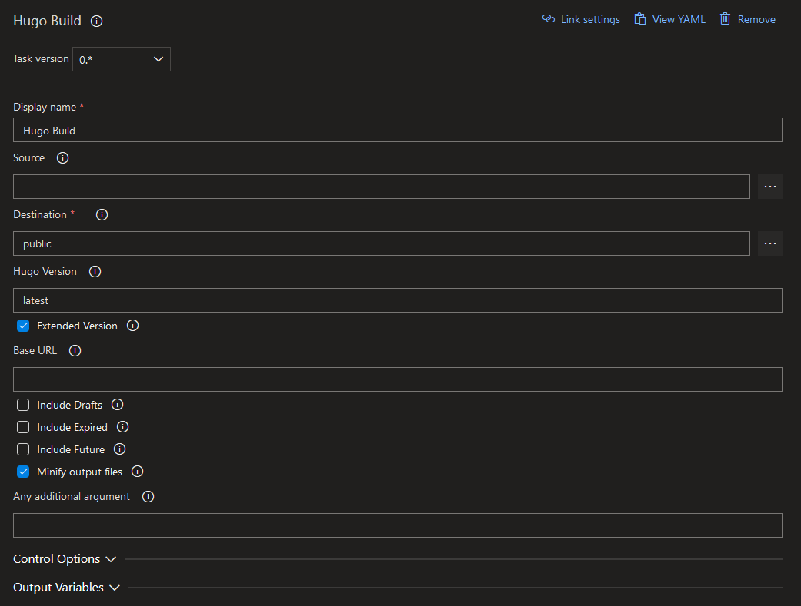

Generates a site using Hugo, a fast and flexible static website generator.

This is a fork/re-work of [Hugo VSTS Extension by Giulio Vian](https://github.com/giuliov/hugo-vsts-extension) to fix build issues with the latest Hugo version.

# Usage

The Build Task will automatically download the `hugo` executable, if the version is not already present on the build machine, and invoke it.

You can specify some common options.

- **Source**: relative path from repo root of the Hugo sources, defaults to `Build.SourcesDirectory`, passed as `--source` flag.
- **Destination**: path of Hugo generated site, typically `Build.ArtifactStagingDirectory`, passed as `--destination` flag.
- **Hugo Version**: defines the Hugo version, use `latest`, `0.25.1`, `0.24`, but not `v0.24` (pick valid values from Hugo [Releases](https://github.com/gohugoio/hugo/releases) page). If the preferred version cannot be found, the latest released version will be used instead.
- **Extended Version**: download the extended Hugo version (SCSS/Sass support).
- **Base URL**: sets the hostname (and path) to the root, e.g. `https://example.com/`, passed as `--baseURL` flag.
- **Include Drafts**: to include content marked as draft, passed as `--buildDrafts` flag.
- **Include Expired**: to include expired content, passed as `--buildExpired` flag.
- **Include Future**: to include content with publishdate in the future, passed as `--buildFuture` flag.
- **Minify Output**: to minify supported output files (HTML, CSS, XML, etc...).

More information on Hugo on [this website](https://gohugo.io/).

The Hugo logos are copyright © Steve Francia 2013–2022.

# Release Notes

- Initial release

## TODO

- Add instructions for building this extension
